# Fabric-Pattern-Color Classifier Model API 
A FastAPI-based image classification API that predicts:

- Fabric type (12 classes like Cotton, Wool, Denim, etc.)
- Pattern type (12 classes like Floral, Geometric, Stripes, etc.)
- Dominant colors from an image

This project uses TensorFlow (MobileNetV2) for the fabric & pattern classifiers and KMeans clustering for dominant color extraction.

# Fabric Model 
- **Architecture:** MobileNetV2 (transfer learning)
- **Classes:** 12 types of fabrics

<table>
  <tr>
    <td align="center">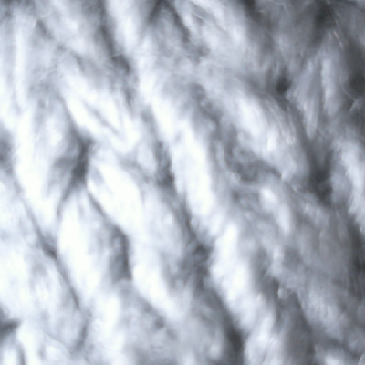 Acrylic</td>
    <td align="center">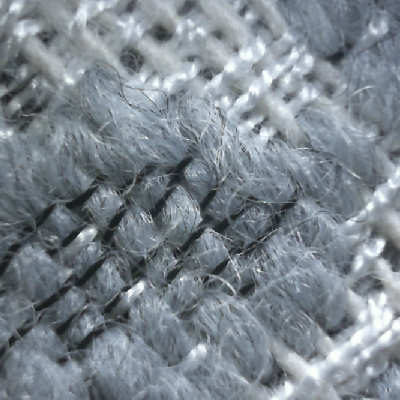 Blended</td>
    <td align="center">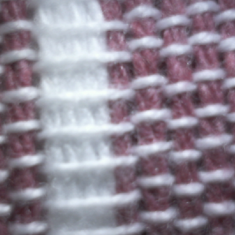 Cotton</td>
    <td align="center">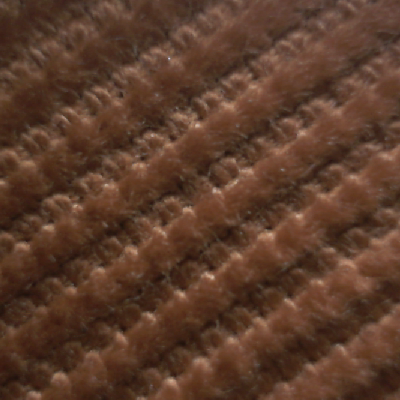 Denim</td>
  </tr>
  <tr>
    <td align="center">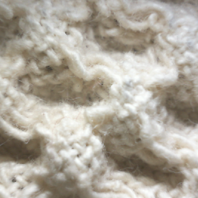 Fleece</td>
    <td align="center">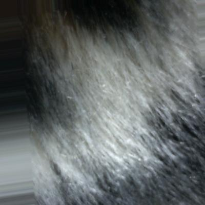 Fur</td>
    <td align="center">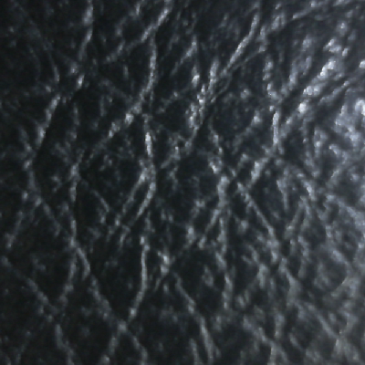 Leather</td>
    <td align="center">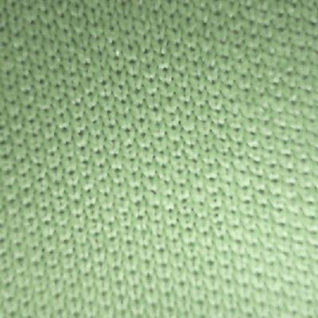 Polyester</td>
  </tr>
  <tr>
    <td align="center">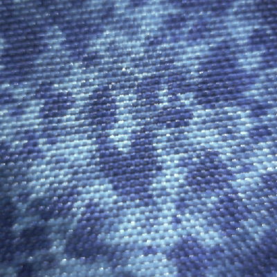 Silk</td>
    <td align="center">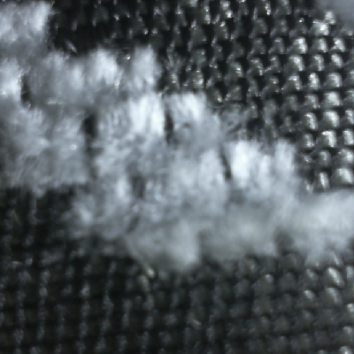 Velvet</td>
    <td align="center">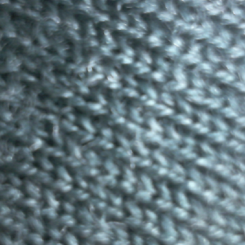 Wool</td>
    <td align="center"> other</td>
  </tr>
</table>

# Pattern Model 
- **Architecture:** MobileNetV2 (transfer learning)
- **Classes:** 12 types of patterns

<table>
  <tr>
    <td align="center">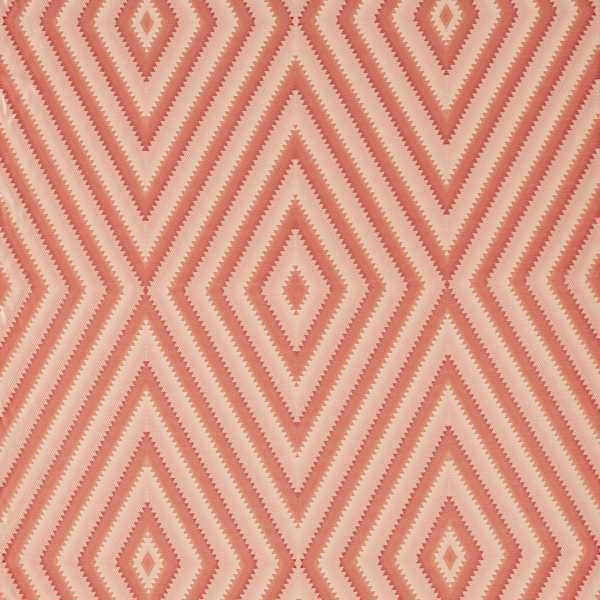 abstract_graph</td>
    <td align="center">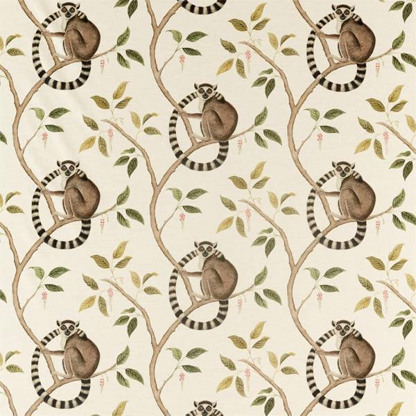 Animals</td>
    <td align="center">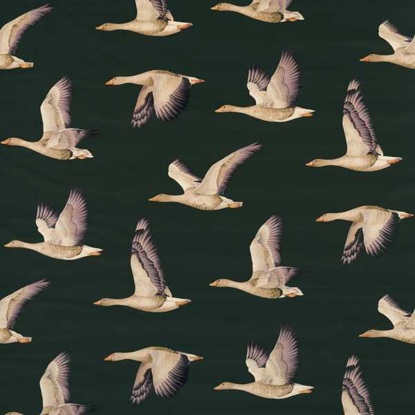 Birds</td>
    <td align="center">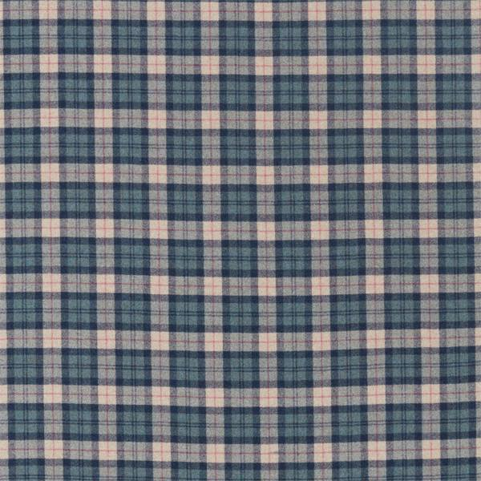 Checks</td>
  </tr>
  <tr>
    <td align="center">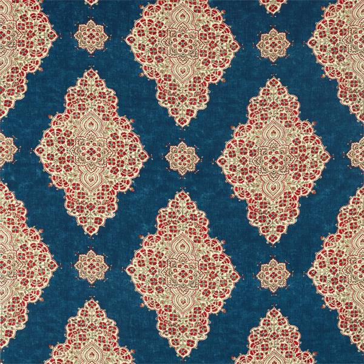 Damaks</td>
    <td align="center">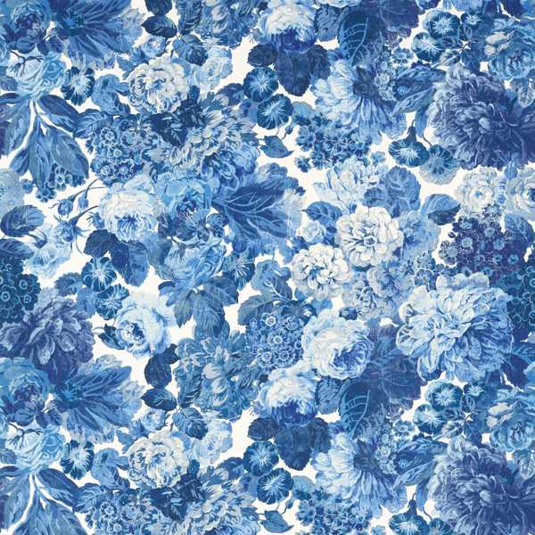 Floral</td>
    <td align="center">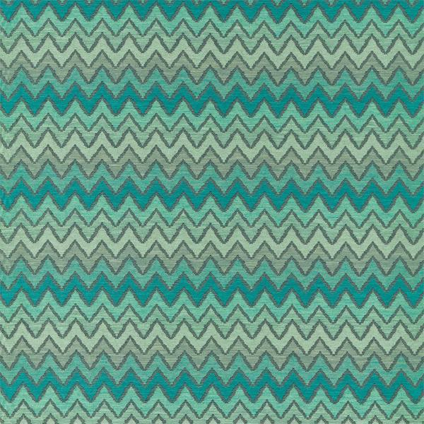 Geometric</td>
    <td align="center">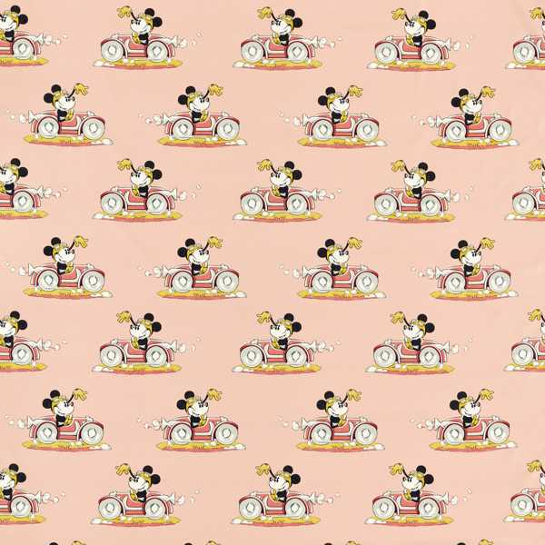 Kids</td>
  </tr>
  <tr>
    <td align="center">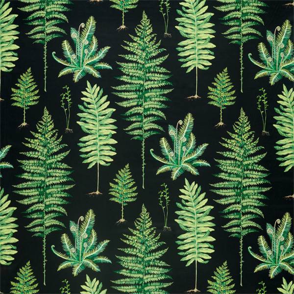 Leafs Trees</td>
    <td align="center">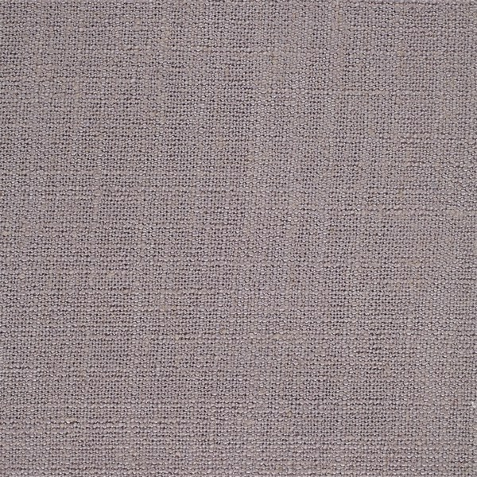 Plain texture</td>
    <td align="center">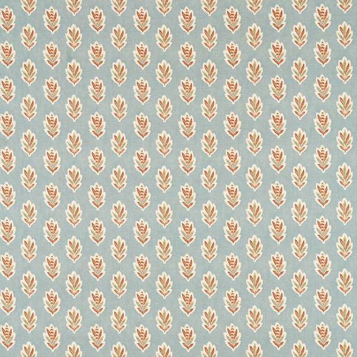 Spots</td>
    <td align="center">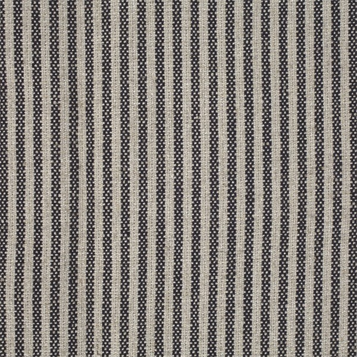 Stripes</td>
  </tr>
</table>

# Color Model

- **Method:** KMeans clustering on image pixels (OpenCV + scikit-learn)
- **Goal:** Extract dominant color and map to the nearest known color name